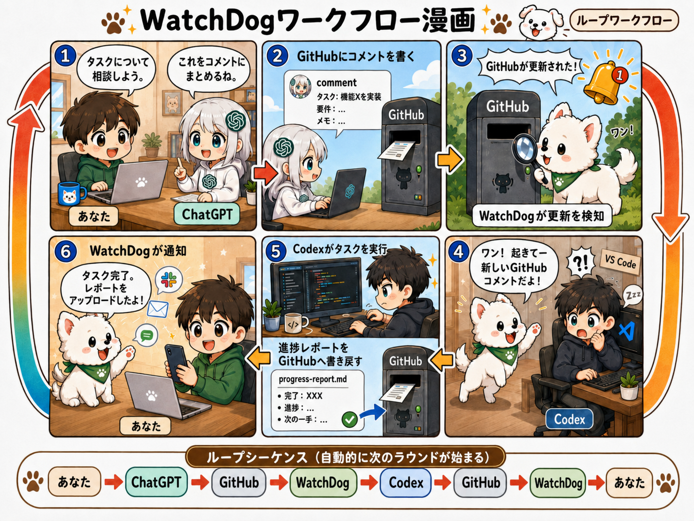
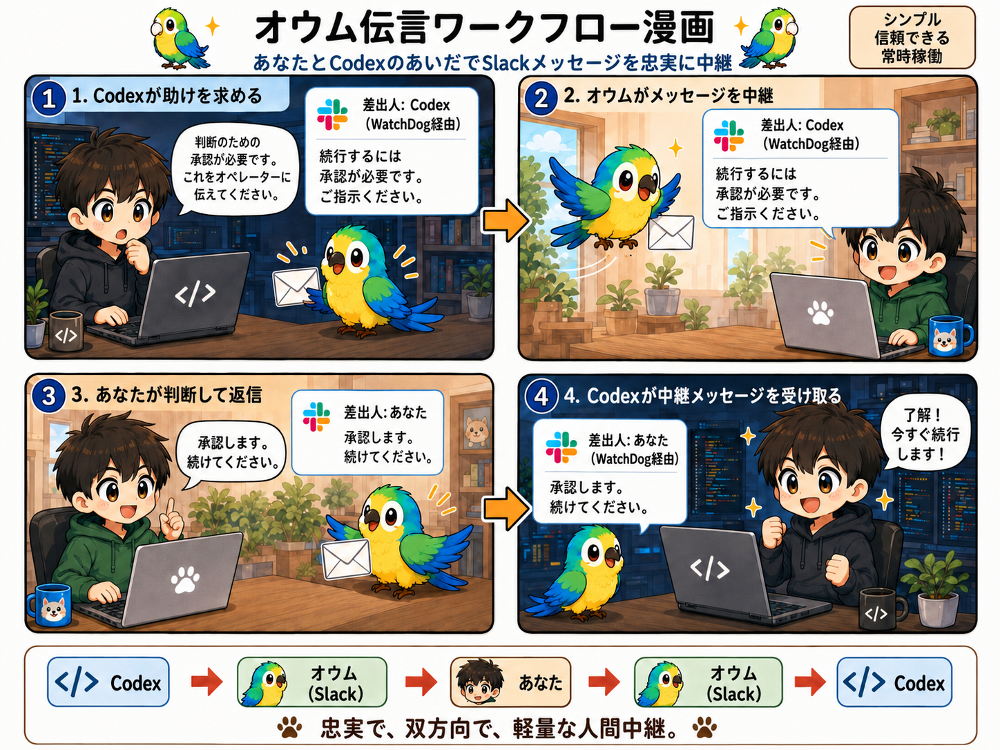

# Codex WatchDog

<p align="center">
  <a href="README.md">English</a> | <a href="README.zh-CN.md">中文</a> | <strong>日本語</strong>
</p>

<p align="center">
  
</p>

既存の VS Code Codex セッションを見守り、必要なときに起こし、メッセージを
中継し、結果を通知する、軽量で決定論的なウォッチドッグです。新しい AI
エージェントとして振る舞うことはありません。

## ワークフロー早見図

### WatchDog：GitHub を使った永続的なループ



### Parrot Dog：Slack を使った素早い双方向中継



## 設計思想

- **軽量で決定論的。** 小さく明示的で、確認・テストしやすい仕組みだけを使います。
- **人間をループの中心に置き、手間を減らす。** 重要な判断は人が行い、定型的な
  監視と中継だけを WatchDog に任せます。
- **WatchDog observes Git; Codex owns Git.** WatchDog は Git を観察するだけです。
  ステージ、コミット、pull、merge、rebase、reset、checkout、push は Codex が
  担当します。
- **GitHub は永続的な管理・レビュープレーン。** コメント、コミット、進捗報告に
  よって、端末や時間をまたいで文脈を残します。
- **管理側には依存せず、実行側は現状 Codex 固有です。** GitHub に永続的な指示を
  書けるなら、管理側は人、ChatGPT、別のエージェント、あるいは自動化スクリプトでも
  構いません。一方、現在の実行側は Codex の正確なスレッドキュー、Hooks、
  rollout／完了イベントの仕組みに依存しています。
- **Slack は素早く認証された中継プレーン。** 通知と許可された短い返信に使い、
  永続的なプロジェクト履歴の代わりにはしません。
- **余分な AI エージェントや過剰なオーケストレーションを増やさない。** WatchDog
  は正確な既存 Codex スレッドへ証拠と指示を届け、推論と作業は Codex が行います。

## 主な機能

- Codex の Stop／完了イベントを観察し、最終出力を通知できます。
- 新しい会話を作らず、正確な既存 Codex スレッドを継続または再開します。
- 読み取り専用のリモート Git OID 確認を GitHub 更新の呼び鈴として使い、同期は
  Codex に任せます。
- Slack 通知、Outlook／SMTP フォールバック、ローカル監査記録に対応します。
- ローカルと VS Code Remote-SSH の対象ワークスペースを検出します。
- WatchDog が作成した Slack スレッドから、許可された返信だけを Codex に戻す
  **Parrot Dog** 中継を任意で利用できます。
- どの実行環境でも WatchDog による Git 変更を禁止します。

## クイックスタート - Windows x64 ベータ

**いちばん簡単な導入方法：** お使いの Codex にこのリポジトリをスキャンさせ、インストールから起動まで順番に案内してもらってください。

1. [GitHub Releases](https://github.com/yesunhuang/codex-watchdog/releases) から
   `codex-watchdog-vX.Y.Z-windows-x64.zip` と `SHA256SUMS.txt` をダウンロードし、
   チェックサムを確認して ZIP 全体を展開します。Python は不要です。
2. ネイティブフックを導入する場合は、空白を含まない固定パスへ展開してください。
   Git、Codex を導入した VS Code、Codex CLI、Windows OpenSSH は別途必要です。
3. `codex-watchdog.exe` をダブルクリックします。バージョン付きのユーザー別
   起動プロファイルが作成または再利用され、フォアグラウンド監視が始まります。
   停止するには Ctrl-C を押すか、コンソールを閉じます。
4. 確認や詳細オプションには引き続き PowerShell を利用できます。

   ```powershell
   .\codex-watchdog.exe --version
   .\watchdog.ps1 -DryRun
   ```

5. ネイティブ Codex フックを生成して内容を確認し、安全な方法でインストールします。

   ```powershell
   .\codex-watchdog.exe install-user-hooks
   .\codex-watchdog.exe install-user-hooks --install
   ```

   異なる `hooks.json` がすでに存在する場合、インストーラーは上書きしません。
   詳細ガイドに従って手動で統合してください。その後 Codex で `/hooks` を開き、
   正確な定義を確認して手動で信頼します。

アップグレード時には、互換性のある起動プロファイル、既存の WatchDog フックが
参照するランタイム、または隣接する最新の旧バージョンのランタイムが自動的に
再利用されます。Slack、Outlook、Duo、OAuth、ワークスペース、通知設定のコピーや
再入力は不要です。新しいフックを確認・置換し、Codex で信頼するまでは旧バージョン
のディレクトリを残してください。

通知、Slack 返信中継、Outlook OAuth、Remote-SSH、Duo フォールバック、ソース
インストールは必要な場合だけ設定します。詳しくは
[Windows パッケージガイド](WINDOWS_PACKAGE.md)と
[詳細なセットアップ・運用ガイド](docs/SETUP.md)を参照してください。

## 典型的な流れ

```text
人 / manager agent -> GitHub -> WatchDog -> 正確な Codex スレッド
                    進捗/報告 <- Codex -> 通知

Codex -> Parrot Dog (Slack) -> 人 -> Parrot Dog -> 正確な Codex スレッド
```

人、ChatGPT、別のエージェント、または自動化が GitHub に永続的な指示を残せます。
WatchDog が更新を検知して既存スレッドを起こし、Codex が作業と Git 操作、進捗報告を
担当します。WatchDog はその結果を通知し、短い判断が必要なときは Parrot Dog が
Slack で往復を中継します。

## AI 開発に関する宣言

本プロジェクトは、**人間が主導し、AI を広範に活用した vibe-coding
プロジェクト**です。

- **人間のメンテナー：** 製品方針、アーキテクチャと安全境界、受け入れ判断、
  リリース責任を担います。
- **ChatGPT：** アーキテクチャの議論とレビュー、障害分析、指示書・文書の作成を
  支援します。
- **OpenAI Codex：** 実装、テスト、診断、パッケージング、反復的な修正の大部分を
  担います。

詳細な dogfooding 記録を公開し、この協働方法を明示的かつ検証可能にしています。

## 関連ドキュメント

- [Windows パッケージと初回セットアップ](WINDOWS_PACKAGE.md)
- [詳細なセットアップと運用](docs/SETUP.md)
- [セキュリティポリシーと運用境界](SECURITY.md)
- [アーキテクチャ決定](doc/architecture.md)
- [画像の出典](ASSETS.md)と[サードパーティ通知](THIRD_PARTY_NOTICES.md)
- [実装計画](doc/codex_watchdog_implementation_plan.md)
- [Dogfooding と開発履歴](doc/Progress/)

> [!NOTE]
> Codex WatchDog は独立したコミュニティプロジェクトです。OpenAI、Microsoft、
> GitHub、Slack、またはその関連会社による提携・推奨プロジェクトではありません。
