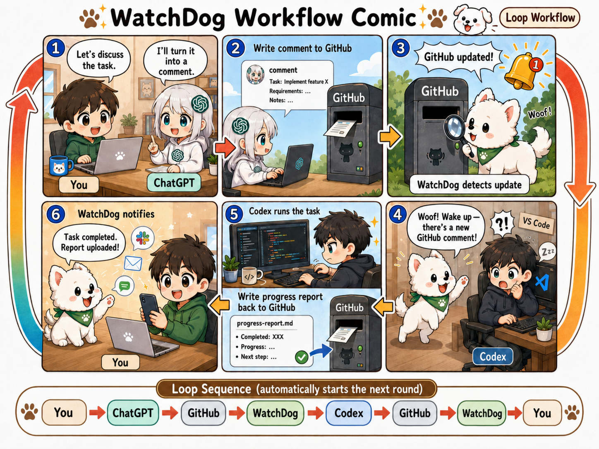
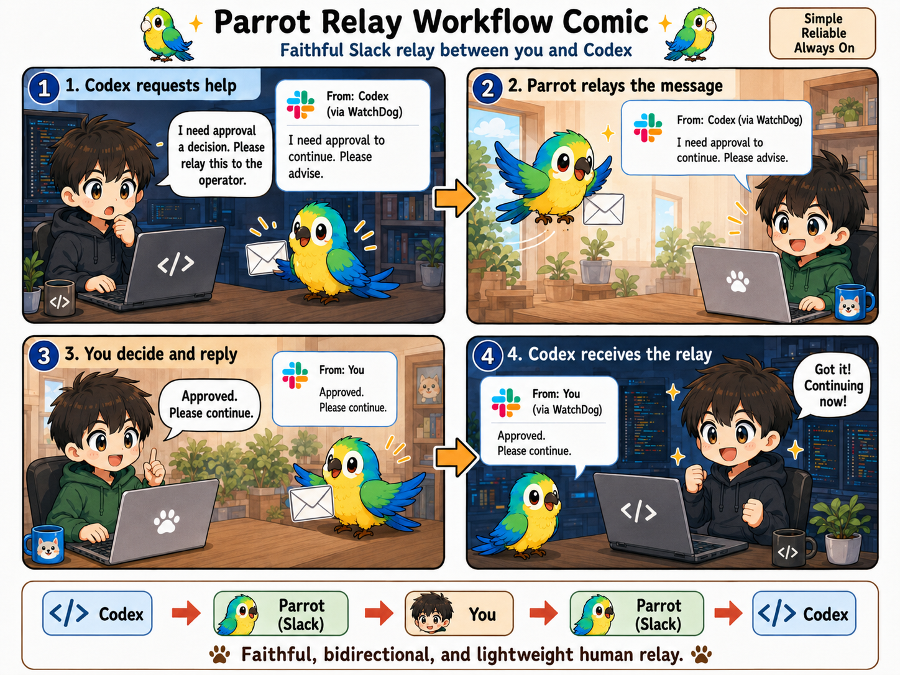

# Codex WatchDog

<p align="center">
  <strong>English</strong> | <a href="README.zh-CN.md">中文</a> | <a href="README.ja.md">日本語</a>
</p>

<p align="center">
  
</p>

A lightweight, deterministic watchdog for existing VS Code Codex sessions: it
watches, wakes, relays, and notifies without becoming another AI agent.

## Workflows at a glance

### WatchDog: the durable GitHub loop



### Parrot Dog: the quick Slack relay



## Design philosophy

- **Lightweight and deterministic.** Small, explicit mechanisms are easier to
  inspect, test, and trust.
- **Human in the loop, with low friction.** You keep control of decisions while
  routine observation and routing stay out of the way.
- **WatchDog observes Git; Codex owns Git.** WatchDog never stages, commits,
  pulls, merges, rebases, resets, checks out, or pushes.
- **GitHub is the durable management and review plane.** Comments, commits, and
  progress reports preserve context across machines and time.
- **Manager-agnostic, Codex-specific.** The management side is intentionally
  replaceable: any human, agent, or automation that can write durable direction
  to GitHub can drive WatchDog. The execution side currently depends on Codex's
  exact-thread queue, hooks, and rollout/completion contracts.
- **Slack is the quick authenticated relay plane.** It is for notifications and
  short allowlisted replies, not durable project history.
- **No extra agent and no unnecessary orchestration.** WatchDog routes evidence
  and instructions to the exact existing Codex thread; Codex still does the
  reasoning and work.

## What it does

- Observes Codex Stop/completion events and can capture the final output for a
  notification.
- Continues or wakes the exact existing Codex thread instead of starting a new
  context.
- Uses read-only Git remote-OID checks as a GitHub update doorbell, then lets
  Codex perform any synchronization.
- Sends Slack notifications with Outlook/SMTP fallback and a local audit trail.
- Discovers eligible local and VS Code Remote-SSH workspaces.
- Optionally relays allowlisted replies from a WatchDog-created Slack thread
  back to Codex (the **Parrot Dog** path).
- Enforces a zero-Git-mutation boundary in every WatchDog locality.

## Quick start - Windows x64 beta

**Ultra-easy setup:** ask your local Codex to scan this repository and guide you through installation and startup step by step.

1. Download `codex-watchdog-vX.Y.Z-windows-x64.zip` and
   `SHA256SUMS.txt` from [GitHub Releases](https://github.com/yesunhuang/codex-watchdog/releases),
   verify the checksum, and extract the complete ZIP. Python is not required.
2. If you will install native hooks, use a permanent extraction path without
   spaces. Git, VS Code with Codex, Codex CLI, and Windows OpenSSH remain
   external prerequisites.
3. Double-click `codex-watchdog.exe`. It creates or reuses a versioned
   current-user launcher profile and starts the foreground monitor. Press
   Ctrl-C or close its console window to stop it.
4. PowerShell remains available for inspection and advanced options:

   ```powershell
   .\codex-watchdog.exe --version
   .\watchdog.ps1 -DryRun
   ```

5. Render, review, and conservatively install the native Codex hooks:

   ```powershell
   .\codex-watchdog.exe install-user-hooks
   .\codex-watchdog.exe install-user-hooks --install
   ```

   If another `hooks.json` already exists, the installer refuses to overwrite
   it; follow the detailed setup guide to merge it manually. In Codex, open
   `/hooks`, inspect the exact definitions, and trust them.

> [!IMPORTANT]
> An upgrade automatically reuses a compatible launcher profile, the runtime
> referenced by existing WatchDog hooks, or the newest adjacent previous-release
> runtime. It does not copy or re-enter Slack, Outlook, Duo, OAuth, workspace, or
> notification state. Keep the previous release directory until any hooks that
> invoke its executable have been reviewed, replaced, and trusted in Codex.

Notifications, Slack reply relay, Outlook OAuth, Remote-SSH, Duo fallback, and
source installation are opt-in. See the [Windows package guide](WINDOWS_PACKAGE.md)
and [detailed setup and operations](docs/SETUP.md) when you need them.

## Typical workflow

```text
human / manager agent -> GitHub -> WatchDog -> exact Codex thread
                        progress/report <- Codex -> notification

Codex -> Parrot Dog (Slack) -> human -> Parrot Dog -> exact Codex thread
```

A human, ChatGPT, another agent, or automation can leave durable direction on
GitHub. WatchDog notices the change and rings the doorbell for the existing
thread. Codex owns the work and Git operations, writes the progress record, and
WatchDog reports the outcome.

## AI development declaration

This is a **human-led vibe-coding project with extensive AI assistance**:

- **Human maintainer:** product direction, architecture and safety boundaries,
  acceptance decisions, and release responsibility.
- **ChatGPT:** architecture discussion and review, failure analysis, and
  instruction/document drafting.
- **OpenAI Codex:** most implementation, tests, diagnostics, packaging, and
  iterative fixes.

The detailed dogfooding record is public so this collaboration is explicit,
inspectable, and not presented as conventional human-only development.

## More docs

- [Windows package and first-time setup](WINDOWS_PACKAGE.md)
- [Detailed setup and operations](docs/SETUP.md)
- [Security policy and operational boundary](SECURITY.md)
- [Architecture decision](doc/architecture.md)
- [Asset provenance](ASSETS.md) and [third-party notices](THIRD_PARTY_NOTICES.md)
- [Implementation plan](doc/codex_watchdog_implementation_plan.md)
- [Historical feasibility probe](doc/probe_report.md)
- [Dogfooding and development history](doc/Progress/)

> [!NOTE]
> Codex WatchDog is an independent community project. It is not affiliated
> with or endorsed by OpenAI, Microsoft, GitHub, Slack, or their affiliates.
