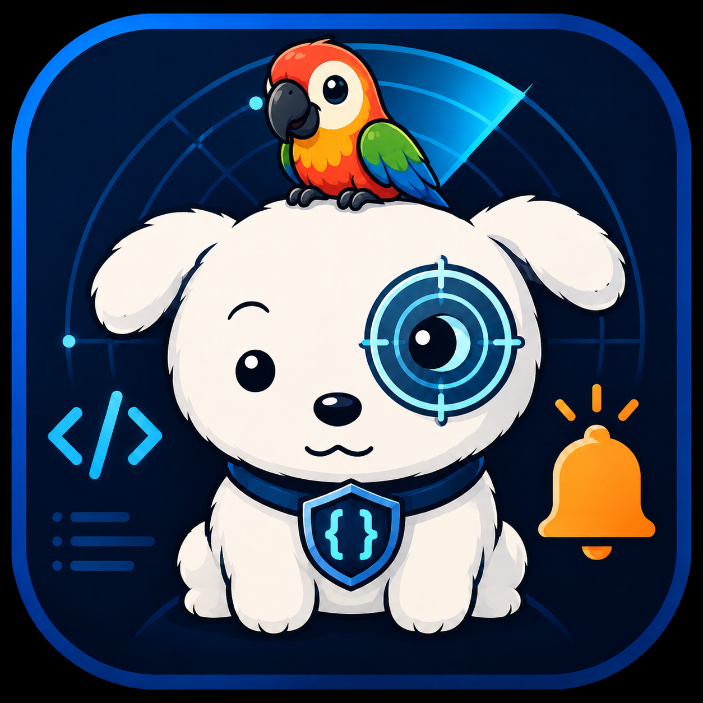
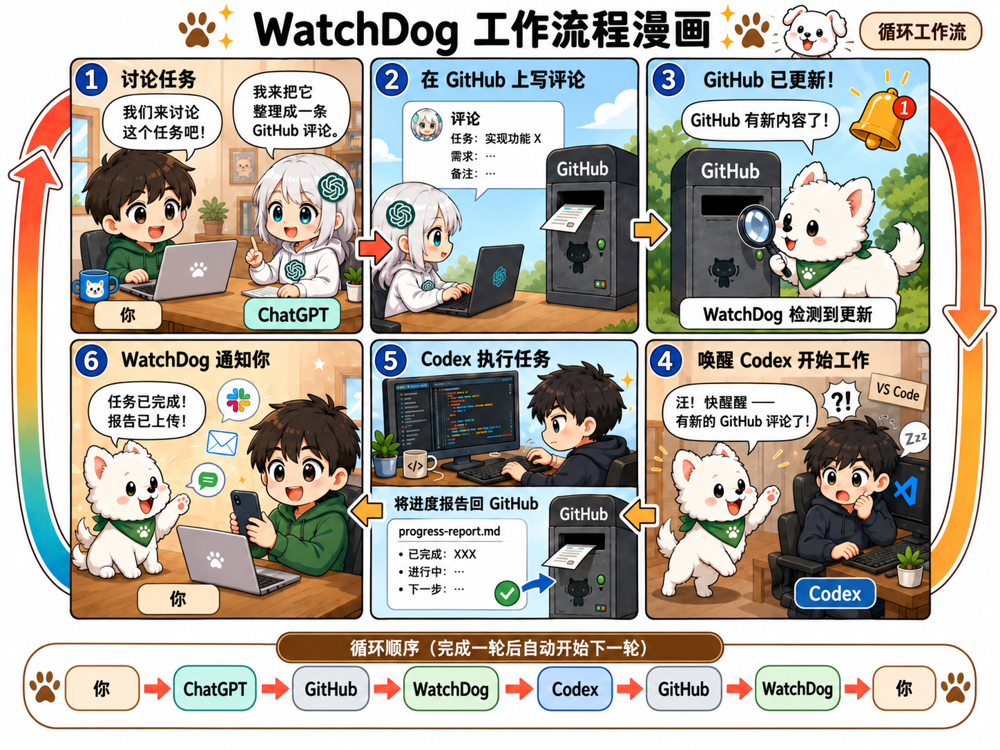
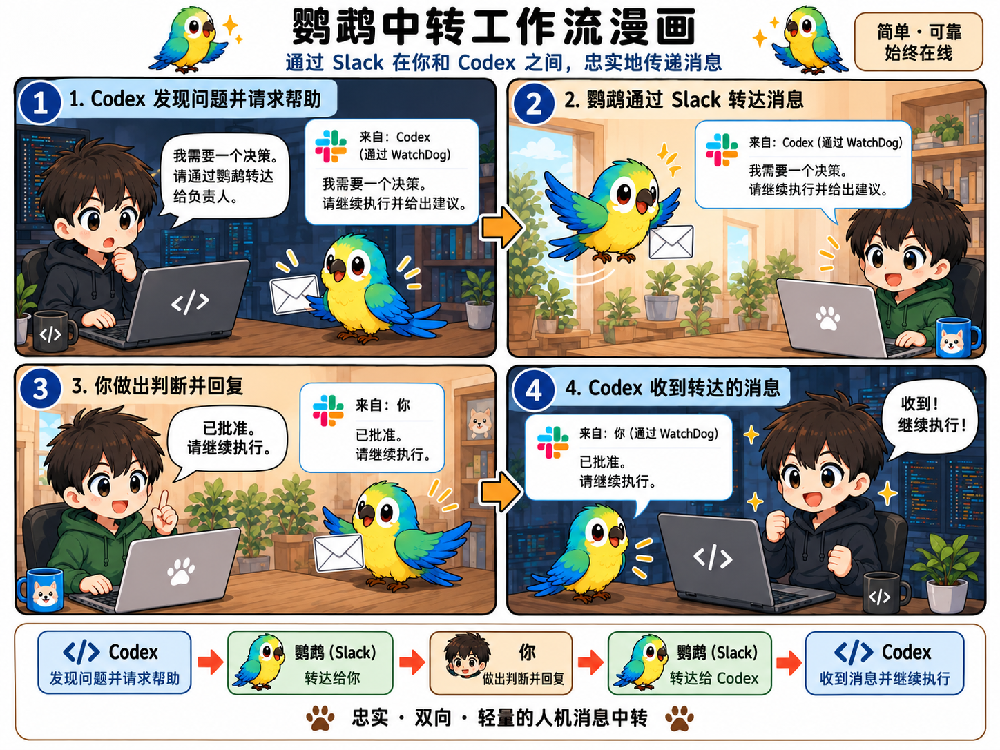

# Codex WatchDog

<p align="center">
  <a href="README.md">English</a> | <strong>中文</strong> | <a href="README.ja.md">日本語</a>
</p>

<p align="center">
  
</p>

一个面向现有 VS Code Codex 会话的轻量、确定性看门狗：负责观察、唤醒、
转发与通知，但不会变成另一个 AI agent。

## 工作流程一览

### WatchDog：持久的 GitHub 循环



### Parrot Dog：快捷的 Slack 双向中转



## 设计理念

- **轻量且确定。** 只使用小而明确、容易检查和测试的机制。
- **人始终在环，操作尽量顺滑。** 关键决策仍由你掌握，WatchDog 只减少重复的
  观察和转发工作。
- **WatchDog observes Git; Codex owns Git。** WatchDog 只观察 Git；暂存、
  提交、拉取、合并、变基和推送都由 Codex 负责。
- **GitHub 是持久的管理与审阅平面。** 评论、提交和进度报告可以跨机器、跨时间
  保留完整上下文。
- **Slack 是快速且经过认证的转发平面。** 它适合通知和短回复，不代替持久的项目
  记录。
- **不增加额外 AI agent，也不过度编排。** WatchDog 把证据和指令送回准确的
  现有 Codex 线程，推理和工作仍由 Codex 完成。

## 它能做什么

- 观察 Codex 的 Stop/完成事件，并可把最终输出放进通知。
- 继续或唤醒准确的现有 Codex 线程，不创建丢失上下文的新会话。
- 以只读的远端 Git OID 检查充当 GitHub 更新门铃，再由 Codex 完成同步。
- 发送 Slack 通知，支持 Outlook/SMTP 回退，并保留本地审计记录。
- 自动发现符合条件的本地与 VS Code Remote-SSH 工作区。
- 可选地把 WatchDog 创建的 Slack 线程中的白名单回复转发回 Codex，也就是
  **Parrot Dog（鹦鹉狗）**路径。
- 在所有运行位置强制遵守“WatchDog 不修改 Git”的边界。

## 快速开始 - Windows x64 Beta

1. 从 [GitHub Releases](https://github.com/yesunhuang/codex-watchdog/releases)
   下载 `codex-watchdog-vX.Y.Z-windows-x64.zip` 和 `SHA256SUMS.txt`，校验后
   完整解压。无需安装 Python。
2. 如果要安装原生 Hook，请选择一个不含空格的固定解压路径。Git、带 Codex 的
   VS Code、Codex CLI 和 Windows OpenSSH 仍需单独安装。
3. 在解压目录打开 PowerShell，先检查程序：

   ```powershell
   .\codex-watchdog.exe --version
   .\watchdog.ps1 -DryRun -NoDuo
   ```

4. 生成并检查 Hook 配置，然后进行保守安装：

   ```powershell
   .\codex-watchdog.exe --runtime "$PWD\.codex-watchdog" install-user-hooks
   .\codex-watchdog.exe --runtime "$PWD\.codex-watchdog" install-user-hooks --install
   ```

   如果已有不同的 `hooks.json`，安装器会拒绝覆盖；请参考详细设置文档手动合并。
   随后在 Codex 中打开 `/hooks`，检查准确的定义并手动信任。
5. 打开需要监控的 VS Code 工作区和 Codex 线程，然后运行：

   ```powershell
   .\watchdog.ps1 -NoDuo
   ```

   `-NoDuo` 只关闭可选的 PuTTY/Plink 共享连接回退；本地发现和普通的非交互式
   OpenSSH 发现仍可使用。

通知、Slack 回复转发、Outlook OAuth、Remote-SSH、Duo 回退和源码安装都是
按需配置。需要时请阅读 [Windows 打包与安装说明](WINDOWS_PACKAGE.md)和
[详细设置与运行文档](docs/SETUP.md)。

## 典型工作流

```text
human / ChatGPT -> GitHub -> WatchDog -> 准确的 Codex 线程
                 进度/报告 <- Codex -> 通知

Codex -> Parrot Dog（Slack）-> 人 -> Parrot Dog -> 准确的 Codex 线程
```

人或 ChatGPT 在 GitHub 留下持久指令；WatchDog 发现变化并为现有线程按门铃；
Codex 负责实际工作和 Git 操作、写入进度记录，WatchDog 再发送结果通知。

## AI 开发声明

这是一个**由人主导、广泛使用 AI 辅助的 vibe-coding 项目**：

- **人类维护者：** 决定产品方向、架构与安全边界，执行验收并承担发布责任。
- **ChatGPT：** 参与架构讨论与审阅、故障分析，以及指令和文档起草。
- **OpenAI Codex：** 完成大部分实现、测试、诊断、打包和迭代修复。

详细的 dogfooding 记录保持公开，让这套协作方式明确、可检查，而不是把项目包装
成完全由人手工完成的软件。

## 更多文档

- [Windows 打包与首次设置](WINDOWS_PACKAGE.md)
- [详细设置与运行](docs/SETUP.md)
- [安全策略与运行边界](SECURITY.md)
- [架构决策](doc/architecture.md)
- [图片来源](ASSETS.md)与[第三方声明](THIRD_PARTY_NOTICES.md)
- [实现计划](doc/codex_watchdog_implementation_plan.md)
- [Dogfooding 与开发历史](doc/Progress/)

> [!NOTE]
> Codex WatchDog 是独立的社区项目，与 OpenAI、Microsoft、GitHub、Slack
> 及其关联方不存在隶属或背书关系。
